# EHS 管理系统 — 操作手册（完整版）

**版本**: V2.0 &nbsp;&nbsp;|&nbsp;&nbsp; **更新日期**: 2026年3月25日 &nbsp;&nbsp;|&nbsp;&nbsp; **适用角色**: 系统管理员 / EHS全体用户

---

## 📑 目录

1. [系统概述](#1-系统概述)
2. [登录系统](#2-登录系统)
3. [首页总览（EHS管理驾驶舱）](#3-首页总览ehs管理驾驶舱)
4. [系统个性化设置](#4-系统个性化设置)
5. [修改密码与个人中心](#5-修改密码与个人中心)
6. [⭐ 用户管理（管理员）](#6-用户管理管理员)
7. [⭐ 角色管理（管理员）](#7-角色管理管理员)
8. [⭐ 权限分配（管理员）](#8-权限分配管理员)
9. [⭐ 菜单管理（管理员）](#9-菜单管理管理员)
10. [⭐ 组织架构管理（管理员）](#10-组织架构管理管理员)
11. [导航与菜单使用](#11-导航与菜单使用)
12. [外部法规、新闻模块](#12-外部法规新闻模块)
13. [内部事件模块](#13-内部事件模块)
14. [EHS知识问答-AI助理](#14-ehs知识问答-ai助理)
15. [通用表格操作技巧](#15-通用表格操作技巧)
16. [常见问题FAQ](#16-常见问题faq)
17. [附录：新系统初始化检查清单](#17-附录新系统初始化检查清单)

---

## 1. 系统概述

EHS管理系统（Environment, Health & Safety）是基于 VOL Pro 平台构建的企业级环境、健康与安全管理系统。

**系统能做什么？**

| 功能模块 | 说明 |
|---------|------|
| 📊 EHS管理驾驶舱 | 实时KPI看板，安全天数、隐患数、培训率一目了然 |
| 📰 外部法规新闻 | AI自动扫描政府网站，生成EHS法规动态日报/周报/月报 |
| 🏭 内部事件跟踪 | 记录集团各工厂事故、未遂事件、安全隐患 |
| 🤖 AI知识问答 | 基于企业知识库的智能问答，快速查询EHS规章制度 |
| 📋 安全台账 | 管理各类安全检查、培训、应急预案 |
| 👥 用户权限 | 灵活的用户/角色/权限管理，支持多工厂 |

> 💡 **浏览器推荐**：建议使用 **Chrome** 或 **Edge** 最新版本。

---

## 2. 登录系统

### 2.1 打开登录页面

在浏览器地址栏输入系统地址，打开登录页面：

### 2.2 登录步骤

| 步骤 | 操作 |
|:---:|------|
| ① | 在 **用户名** 输入框中输入您的账号 |
| ② | 在 **密码** 输入框中输入您的密码 |
| ③ | 点击 **登 录** 按钮 |

> 📌 首次登录请使用管理员分配的初始账号和密码。登录成功后建议立即修改密码。

### 2.3 登录常见问题

| 问题 | 解决方法 |
|------|---------|
| 提示"用户名或密码错误" | 检查大小写，确认账号和密码是否正确 |
| 页面空白或无法打开 | 检查网络连接，确认系统URL地址正确 |
| 忘记密码 | 联系系统管理员重置密码 |

---

## 3. 首页总览（EHS管理驾驶舱）

登录成功后，系统自动进入 **EHS管理驾驶舱**：

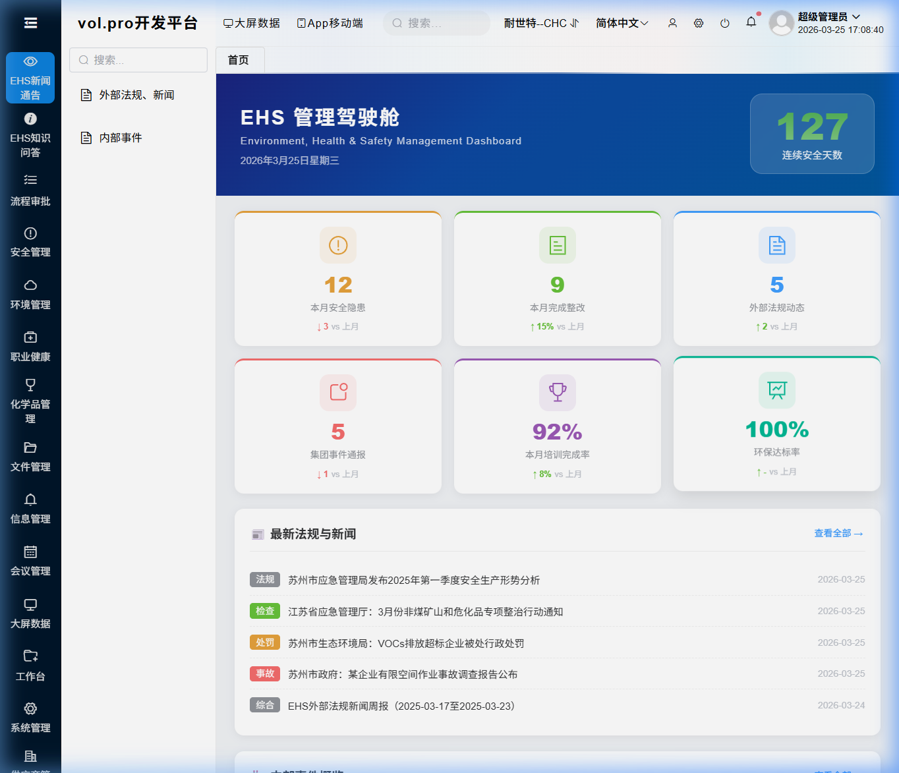

### 3.1 页面区域说明

| 区域 | 位置 | 说明 |
|------|------|------|
| 连续安全天数 | 右上角绿色圆 | 当前工厂的连续无事故天数 |
| KPI指标卡片 | 中间6个彩色卡片 | 本月安全隐患数、应急预案数等核心指标 |
| 最新法规与新闻 | 左下 | AI自动生成的最新EHS法规和行业新闻 |
| 内部事件概览 | 右下 | 集团各工厂最近的安全事件 |

> 💡 点击 **"查看全部 →"** 可跳转到对应详情页面。

---

## 4. 系统个性化设置

### 4.1 切换工厂

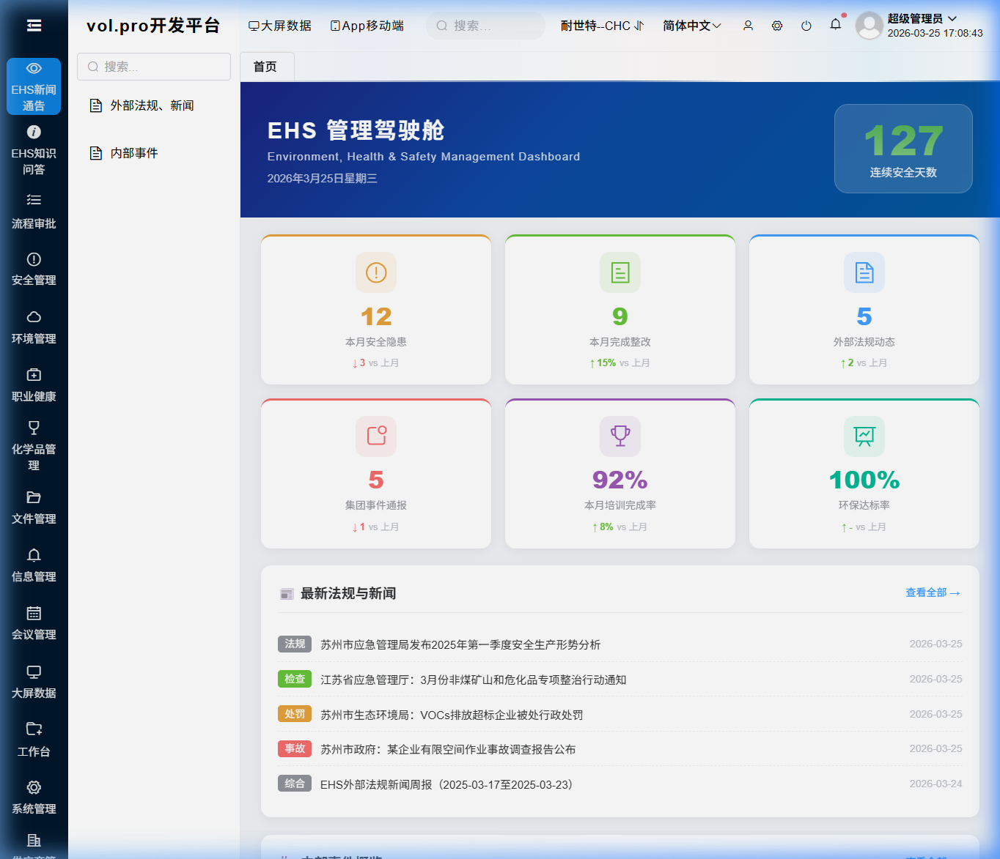

| 步骤 | 操作 |
|:---:|------|
| ① | 点击右上角的 **当前工厂名称**（如"耐世特-柳州"） |
| ② | 在下拉列表中选择目标工厂 |
| ③ | 系统自动切换，所有页面数据更新为所选工厂的数据 |

> ⚠️ 切换工厂后，首页KPI、事件列表等数据都会切换。请确认选择了正确的工厂。

### 4.2 切换语言

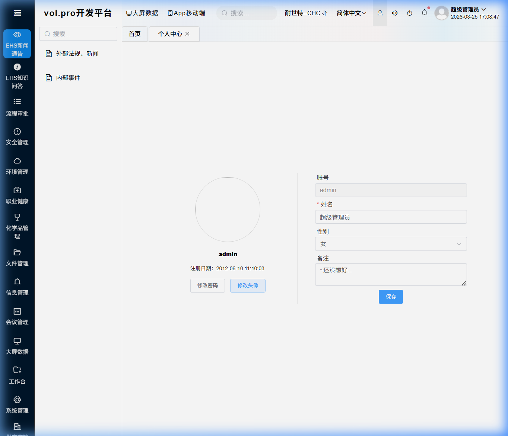

点击右上角的 **语言选项**，可选择：**简体中文**（默认）或 **English**

### 4.3 设置页面主题

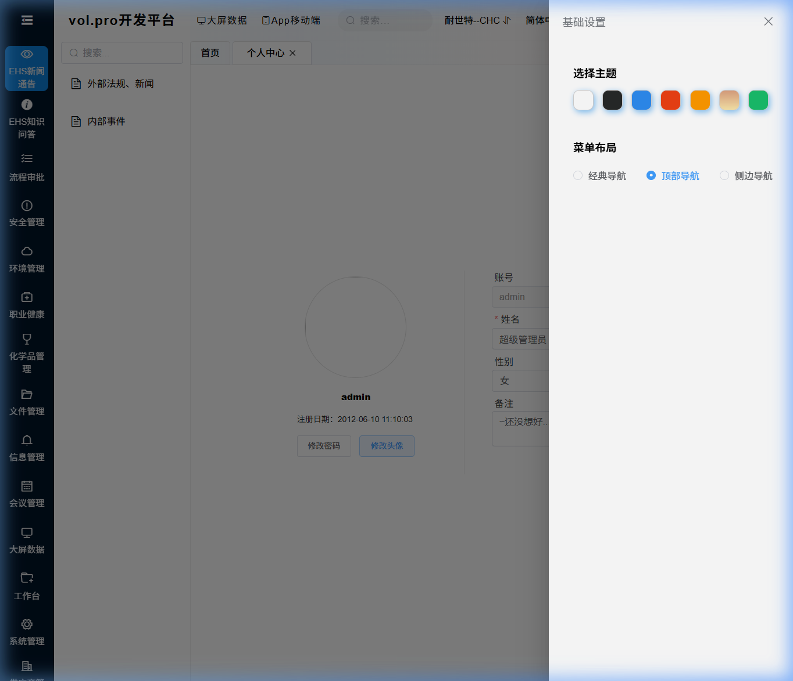

点击右上角的 **⚙️ 设置图标**，可设置：

| 设置项 | 说明 |
|--------|------|
| 导航模式 | 经典模式（左侧菜单，推荐新手使用）/ 顶部导航 / 侧栏导航 |
| 主题色 | 点击色块选择喜欢的颜色，自动保存 |
| 头部设置 | 固定或隐藏顶部导航栏 |

---

## 5. 修改密码与个人中心

| 步骤 | 操作 |
|:---:|------|
| ① | 点击右上角的 **用户头像** 或 **用户名** |
| ② | 选择 **"个人中心"** 或 **"修改密码"** |
| ③ | 输入 **旧密码** |
| ④ | 输入 **新密码**（建议8位以上，含字母和数字） |
| ⑤ | 确认新密码，点击 **确定** |

> ⚠️ 修改密码后需重新登录。请务必记住新密码！

---

## 6. ⭐ 用户管理（管理员）

> 📌 **此章节面向系统管理员**。创建用户账号是使用系统的第一步。

### 6.1 进入方式

点击左侧菜单 **用户管理** → **用户管理**，或通过顶部搜索框搜索"用户"

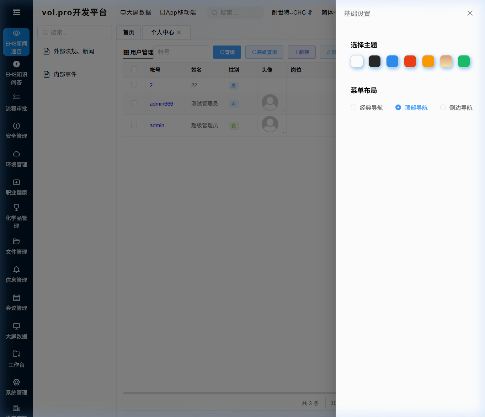

### 6.2 创建新用户（完整步骤）

| 步骤 | 操作 | 说明 |
|:---:|------|------|
| ① | 点击工具栏 **新建(Add)** 按钮 | 弹出新建用户表单 |
| ② | 填写 **用户名**（登录账号） | 必填，建议用工号或姓名拼音，如 `zhangsan` |
| ③ | 填写 **真实姓名** | 必填，显示名称 |
| ④ | 填写 **手机号** | 用于接收通知 |
| ⑤ | 填写 **邮箱** | 用于邮件通知 |
| ⑥ | 设置 **密码** | 初始密码，建议 `Abc@1234`，告知用户首次登录后修改 |
| ⑦ | 选择 **所属部门** | 从下拉列表中选择用户所在部门 |
| ⑧ | 选择 **角色** | 关键步骤！决定用户能看到哪些菜单和操作 |
| ⑨ | 设置 **启用状态** | 默认启用，离职人员可设为禁用 |
| ⑩ | 点击 **保存** | 完成创建 |

### 6.3 编辑用户信息

| 步骤 | 操作 |
|:---:|------|
| ① | 在用户列表中 **勾选** 要编辑的用户 |
| ② | 点击工具栏 **编辑(Update)** 按钮 |
| ③ | 修改相关信息后点击 **保存** |

### 6.4 禁用/启用用户

- **禁用用户**：编辑用户 → 将"启用状态"设为 **禁用** → 保存
- 禁用后该用户将无法登录，但数据保留
- 员工离职时建议 **禁用** 而不是删除，保留操作记录

### 6.5 重置密码

如果用户忘记密码：
1. 找到该用户 → 点击 **编辑**
2. 在密码字段输入新密码
3. 保存后通知用户新密码

### 6.6 批量导入用户

| 步骤 | 操作 |
|:---:|------|
| ① | 点击 **导入(Import)** 按钮 |
| ② | 下载 **导入模板** Excel |
| ③ | 按模板格式填写用户信息 |
| ④ | 上传填好的 Excel 文件 |
| ⑤ | 系统自动批量创建用户 |

### 6.7 用户字段说明

| 字段 | 是否必填 | 说明 |
|------|:-------:|------|
| 用户名 | ✅ | 登录账号，全局唯一，创建后不可修改 |
| 真实姓名 | ✅ | 系统中显示的名称 |
| 密码 | ✅ | 登录密码，建议首次登录后修改 |
| 手机号 | 选填 | 用于通知和联系 |
| 邮箱 | 选填 | 用于邮件通知 |
| 所属部门 | 推荐 | 关联组织架构，影响数据权限 |
| 角色 | ✅ | 决定菜单可见性和操作权限 |
| 启用状态 | 自动 | 启用/禁用 |

---

## 7. ⭐ 角色管理（管理员）

> 📌 角色是权限的载体。每个用户通过"角色"获得对应的菜单和操作权限。

### 7.1 进入方式

点击左侧菜单 **用户管理** → **角色管理**

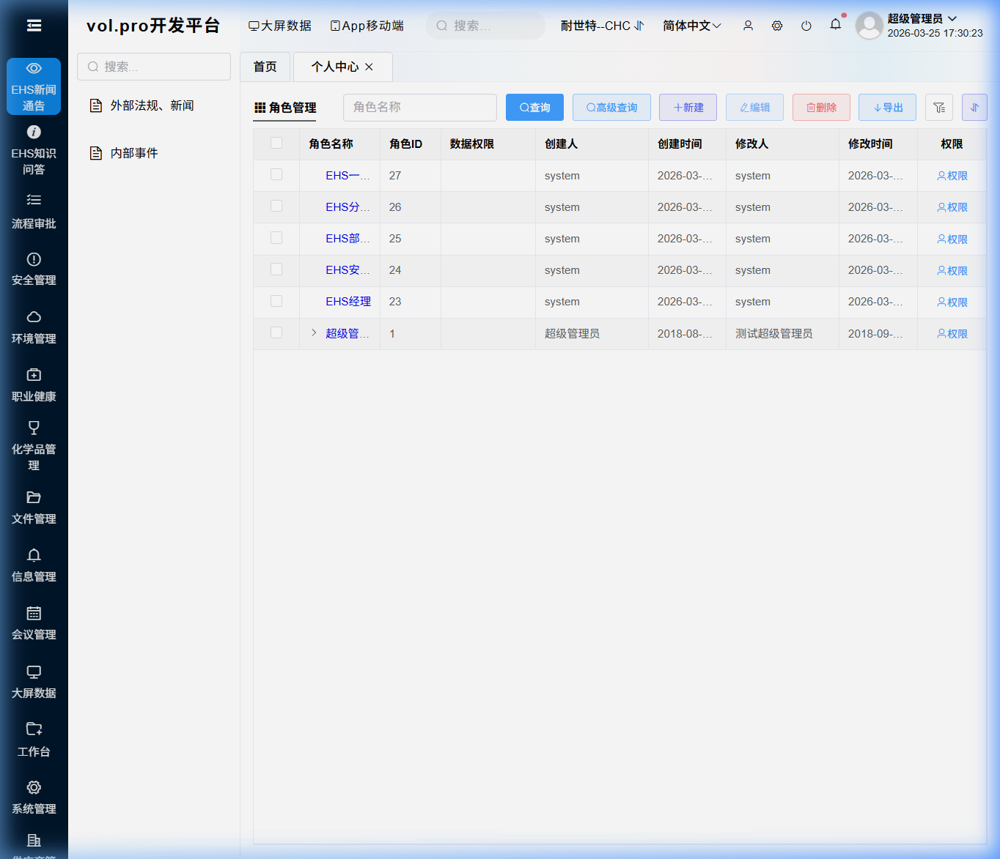

### 7.2 系统预设角色

| 角色名称 | 说明 | 适用人员 |
|---------|------|---------|
| 超级管理员 | 拥有所有权限 | IT管理员 |
| EHS管理员 | 所有EHS模块的完整权限 | EHS部门主管 |
| EHS专员 | EHS模块的查看和编辑权限 | EHS工程师 |
| 普通用户 | 仅首页和知识问答 | 一般员工 |

### 7.3 创建新角色

| 步骤 | 操作 |
|:---:|------|
| ① | 点击 **新建(Add)** 按钮 |
| ② | 填写 **角色名称**（如"苏州工厂EHS主管"） |
| ③ | 填写 **角色描述**（如"负责苏州工厂EHS模块管理"） |
| ④ | 设置 **启用状态** 为启用 |
| ⑤ | 点击 **保存** |
| ⑥ | 保存后进入 **权限分配** 页面为该角色配置菜单权限（见第8节） |

### 7.4 编辑角色

- 勾选角色 → 点击 **编辑(Update)** → 修改后保存
- 修改角色名称或描述不会影响已有权限分配

### 7.5 删除角色

> ⚠️ **注意**：删除角色前，请确保没有用户正在使用该角色。否则这些用户将失去所有权限！

---

## 8. ⭐ 权限分配（管理员）

> 📌 权限分配是将"菜单"和"操作按钮"分配给"角色"的过程。这是系统安全的核心。

### 8.1 进入方式

点击左侧菜单 **用户管理** → **权限管理**

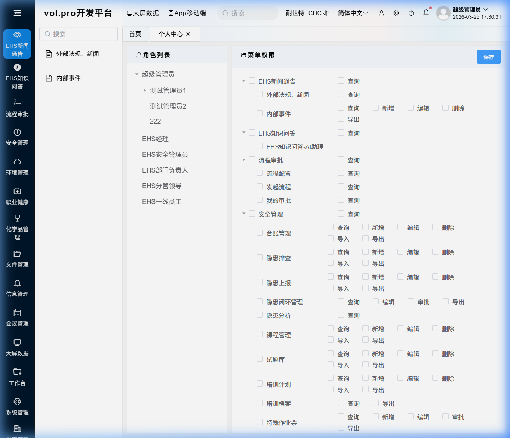

### 8.2 分配菜单权限（完整步骤）

| 步骤 | 操作 | 说明 |
|:---:|------|------|
| ① | 在 **左侧角色列表** 中选择要配置的角色 | 点击角色名称 |
| ② | 右侧显示 **菜单树** | 所有系统菜单以树形结构展示 |
| ③ | **勾选** 该角色需要访问的菜单 | 勾选父节点会自动勾选所有子菜单 |
| ④ | 展开具体菜单 → 勾选 **操作按钮** | 可精细控制：查询/新建/编辑/删除/导出/导入 |
| ⑤ | 点击 **保存** 按钮 | 权限立即生效 |

### 8.3 操作按钮权限详解

| 权限按钮 | 英文 | 说明 |
|---------|------|------|
| 查询 | Search | 允许查看数据列表和搜索 |
| 新建 | Add | 允许新增记录 |
| 编辑 | Update | 允许修改已有记录 |
| 删除 | Delete | 允许删除记录 |
| 导入 | Import | 允许从Excel批量导入 |
| 导出 | Export | 允许导出数据为Excel |
| 上传 | Upload | 允许上传文件附件 |
| 审核 | Audit | 允许审批流程操作 |
| 打印 | Print | 允许打印报表 |

### 8.4 权限分配最佳实践

| 建议 | 说明 |
|------|------|
| 🎯 最小权限原则 | 只给用户必要的权限，不要给多余的 |
| 📋 按岗位创建角色 | 如"EHS专员"、"工厂安全主管"，而不是按个人 |
| 🔒 敏感操作限制 | "删除"权限应严格控制，只给管理员 |
| 📊 导出权限注意 | 含敏感数据的模块，导出权限需谨慎分配 |
| ✅ 必给查询权限 | 进入任何菜单至少需要"查询(Search)"权限 |

### 8.5 典型权限配置示例

**EHS专员角色**的推荐权限配置：

| 菜单模块 | 查询 | 新建 | 编辑 | 删除 | 导出 |
|---------|:---:|:---:|:---:|:---:|:---:|
| 首页驾驶舱 | ✅ | — | — | — | — |
| 外部法规、新闻 | ✅ | — | — | — | ✅ |
| 内部事件 | ✅ | ✅ | ✅ | ❌ | ✅ |
| 知识问答-AI助理 | ✅ | — | — | — | — |
| 安全台账 | ✅ | ✅ | ✅ | ❌ | ✅ |
| 用户管理 | ❌ | ❌ | ❌ | ❌ | ❌ |

**系统管理员角色**：全部勾选 ✅

---

## 9. ⭐ 菜单管理（管理员）

> 📌 菜单管理用于配置系统左侧导航栏中显示的功能模块。

### 9.1 进入方式

点击左侧菜单 **系统设置** → **菜单设置**

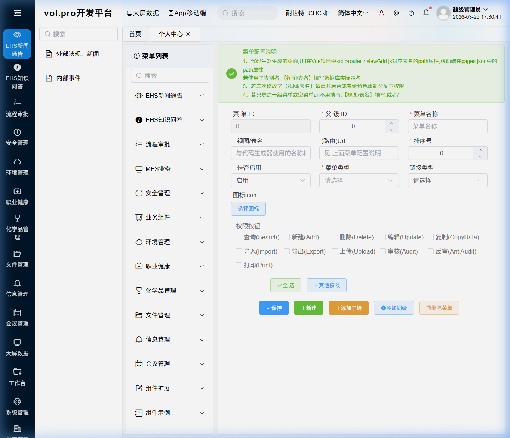

### 9.2 菜单字段说明

| 字段 | 说明 |
|------|------|
| 菜单ID | 系统自动分配的唯一编号 |
| 菜单名称 | 显示在左侧导航栏的名称 |
| 父级ID | 上级菜单的ID，顶级菜单为0 |
| 跳转URL | 内部页面路由路径（如 `/EHS_SafetyLedger`） |
| 排序号 | 数字越大越靠前 |
| 菜单类型 | PC菜单 / App菜单 |
| 链接类型 | 内部页面 / 外部URL链接 |
| 图标Icon | 菜单前的图标样式 |
| 启用状态 | 启用/禁用 |

### 9.3 添加新菜单

| 步骤 | 操作 |
|:---:|------|
| ① | 在菜单树中选择 **父级菜单** |
| ② | 点击 **新建** 按钮 |
| ③ | 填写菜单名称、URL、排序号等 |
| ④ | 设置启用状态为 **启用** |
| ⑤ | 点击 **保存** |
| ⑥ | 到 **权限管理** 中为需要的角色勾选此菜单 |

> ⚠️ 新建菜单后，需要在 **权限管理** 中给对应角色分配权限，否则用户看不到这个菜单。

---

## 10. ⭐ 组织架构管理（管理员）

### 10.1 进入方式

点击左侧菜单 **用户管理** → **组织架构**

### 10.2 功能说明

组织架构用于管理公司的部门层级结构，支持：
- 创建多级部门树（如：集团 → 工厂 → 车间 → 班组）
- 用户关联到部门
- 基于部门的数据权限控制

### 10.3 常用操作

| 操作 | 说明 |
|------|------|
| 新建部门 | 选择父部门 → 新建 → 填写部门名称 → 保存 |
| 编辑部门 | 选中部门 → 编辑 → 修改名称或上级 → 保存 |
| 删除部门 | 确保部门下无用户后再删除 |
| 调整层级 | 编辑部门 → 修改"父级部门"字段 |

---

## 11. 导航与菜单使用

### 11.1 左侧菜单栏

| 菜单分组 | 包含模块 |
|---------|---------|
| EHS新闻通讯 | 外部法规、新闻 / 内部事件 |
| EHS知识问答 | EHS知识问答-AI助理 |
| 安全管理 | 安全台账、隐患排查、事故管理 |
| 环境管理 | 废弃物管理、化学品管理 |
| 职业健康 | 培训管理、PPE管理 |
| 用户管理 | 用户管理 / 角色管理 / 权限管理 / 组织架构 |
| 系统设置 | 菜单设置 / 数据字典 / 定时任务 |

### 11.2 多页签操作

- 点击菜单 → 以 **标签页** 方式打开，可同时打开多个页面
- 点击标签上的 **×** 关闭页面
- **右键** 标签页 → 关闭当前 / 关闭其他 / 关闭全部
- 点击 **"首页"** 随时返回驾驶舱

### 11.3 快速搜索菜单

左侧菜单顶部有 **🔍 搜索框**，输入关键词（如"培训"）即可快速定位菜单。

---

## 12. 外部法规、新闻模块

### 12.1 进入方式

左侧菜单 **EHS新闻通讯** → **外部法规、新闻**

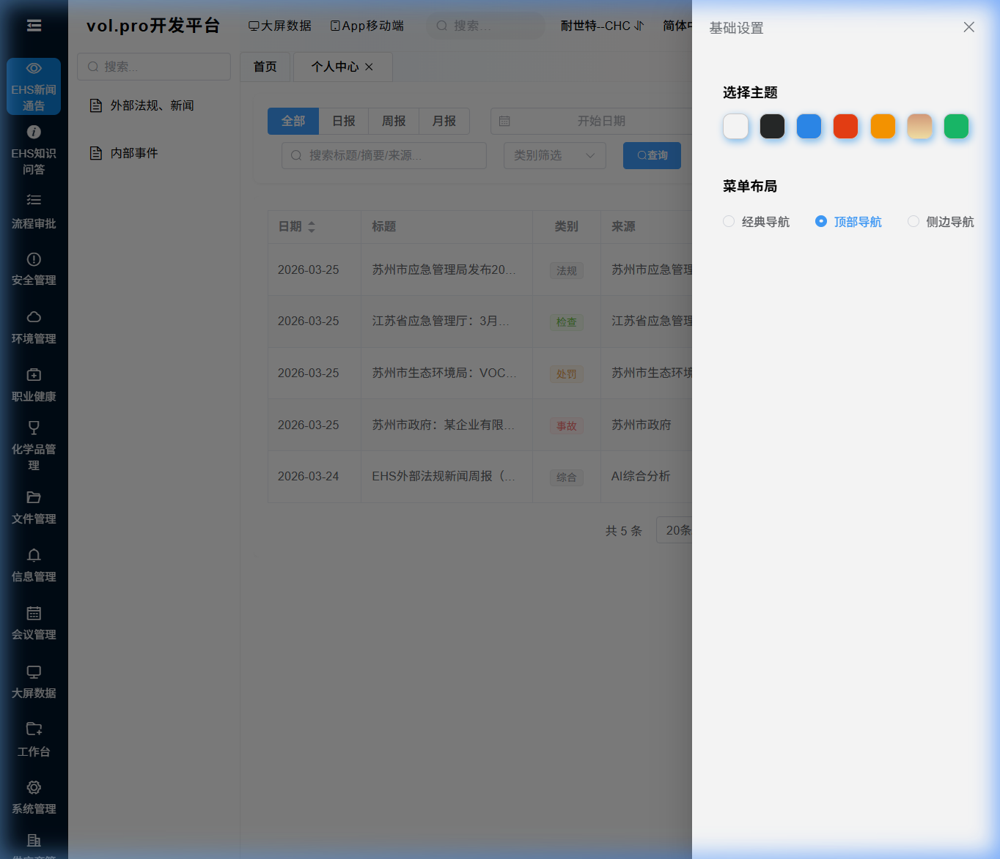

### 12.2 功能说明

本模块由 **AI自动巡检并生成** 最新EHS法规和新闻，覆盖苏州市应急管理局、生态环境局、江苏省应急管理厅等信息源。

### 12.3 操作指南

| 功能 | 操作 |
|------|------|
| 切换报告类型 | 点击 **全部/日报/周报/月报** 标签 |
| 按日期筛选 | 选择开始和结束日期 |
| 搜索关键词 | 输入标题/摘要/来源关键词 |
| 按类别筛选 | 选择事故/处罚/法规/检查等 |
| 查看详情 | 点击任意行 → 弹出详情窗口 |
| 手动生成 | 右上角绿色按钮 → 立即触发AI生成 |

---

## 13. 内部事件模块

### 13.1 进入方式

左侧菜单 **EHS新闻通讯** → **内部事件**

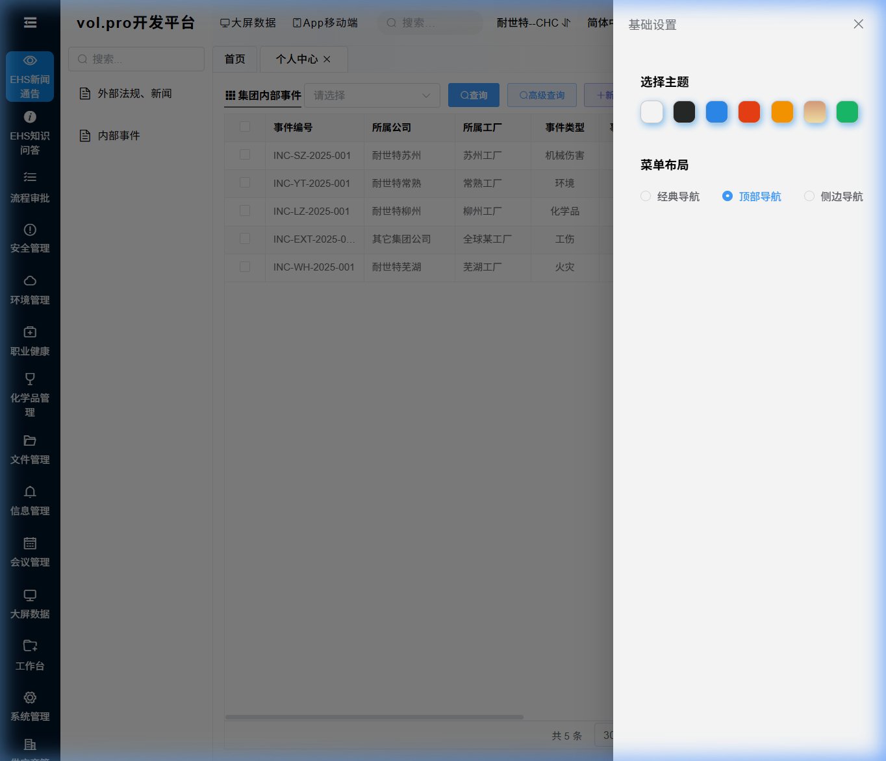

### 13.2 操作指南

| 功能 | 操作 |
|------|------|
| 查询事件 | 输入筛选条件 → 点击 **查询** |
| 新增事件 | 点击 **新建** → 填写事件信息 → 保存 |
| 编辑事件 | 勾选一行 → 点击 **编辑** |
| 删除事件 | 勾选一行 → 点击 **删除** |
| 导出Excel | 点击 **导出** 按钮 |

### 13.3 事件字段

| 字段 | 说明 |
|------|------|
| 所属公司/工厂 | 事件发生的位置 |
| 事件类型 | 工伤事故 / 未遂事件 / 环境事件 / 财产损失 |
| 事件等级 | 一般 / 较大 / 重大 / 特别重大 |
| 受伤/死亡人数 | 人员伤亡统计 |
| 状态 | 待处理 / 处理中 / 已关闭 |

---

## 14. EHS知识问答-AI助理

### 14.1 进入方式

左侧菜单 **EHS知识问答** → **EHS知识问答-AI助理**

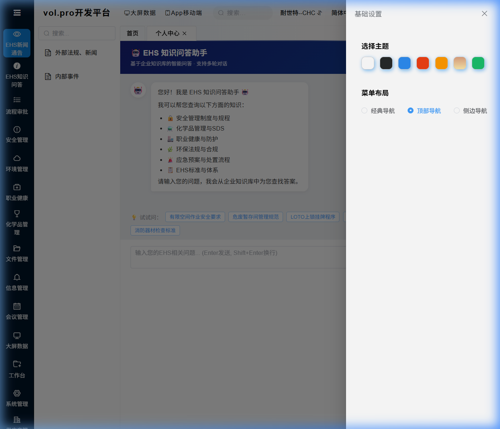

### 14.2 操作指南

| 功能 | 操作 |
|------|------|
| 提问 | 输入问题 → **Enter** 发送 |
| 换行 | **Shift + Enter** |
| 连续追问 | 直接输入，AI自动关联上下文 |
| 新会话 | 右上角 **新会话** 按钮 |
| 测试连接 | 右上角 **测试连接** 检查服务状态 |
| 快捷标签 | 点击底部 💡 标签快速提问 |

### 14.3 使用技巧

- ✅ 问题尽量具体：*"有限空间作业需要哪些审批手续？"*
- ✅ 可以追问细节：*"上面提到的防护设备具体有哪些？"*
- ❌ 避免笼统问题：*"什么是安全？"*

---

## 15. 通用表格操作技巧

### 15.1 基本操作

| 操作 | 方法 |
|------|------|
| 排序 | 点击表头列名 |
| 调整列宽 | 拖拽表头分隔线 |
| 翻页 | 底部分页控件 |
| 每页条数 | 选择 20/50/100 |
| 全选 | 点击表头复选框 |

### 15.2 工具栏按钮

| 按钮 | 功能 |
|------|------|
| 🔍 查询(Search) | 按条件搜索 |
| ➕ 新建(Add) | 新增记录 |
| 🗑️ 删除(Delete) | 删除选中记录 |
| ✏️ 编辑(Update) | 编辑选中记录 |
| 📥 导入(Import) | Excel批量导入 |
| 📤 导出(Export) | 导出为Excel |

### 15.3 新建/编辑表单

- 红色星号 **\*** 标记的为必填字段
- 填写完毕点击 **保存** 提交
- 点击 **取消** 关闭表单

---

## 16. 常见问题FAQ

| 问题 | 解决方法 |
|------|---------|
| 系统打开很慢 | 用 Chrome/Edge，清除缓存（Ctrl+Shift+Delete） |
| 页面样式错乱 | Ctrl+Shift+R 强制刷新 |
| Excel导出乱码 | 用"从文本/CSV"导入，选UTF-8编码 |
| AI问答连接失败 | 点击"测试连接"，联系IT检查知识库服务 |
| 看不到某个菜单 | 联系管理员在"权限管理"中为您的角色分配该菜单 |
| 按钮灰色不能点击 | 您的角色没有该操作权限，联系管理员分配 |
| 忘记密码 | 联系管理员重置 |
| 退出系统 | 右上角头像 → "退出登录" |

---

## 17. 附录：新系统初始化检查清单

以下是部署新系统后，管理员需要完成的初始化步骤：

- [ ] **第1步**：用超级管理员账号登录系统
- [ ] **第2步**：进入 **组织架构** → 创建公司和部门层级
- [ ] **第3步**：进入 **角色管理** → 创建所需角色（EHS管理员、EHS专员、普通用户等）
- [ ] **第4步**：进入 **权限管理** → 为每个角色分配菜单和操作权限
- [ ] **第5步**：进入 **用户管理** → 创建所有用户账号，分配角色和部门
- [ ] **第6步**：通知用户账号和初始密码，要求首次登录后修改密码
- [ ] **第7步**：测试各角色是否只能看到应有的菜单和功能
- [ ] **第8步**：确认AI新闻生成和知识问答功能正常
- [ ] **第9步**：配置定时任务（日报/周报/月报自动生成）

---

> **技术支持**：如遇到本手册未覆盖的问题，请联系EHS系统管理员或IT支持团队。
